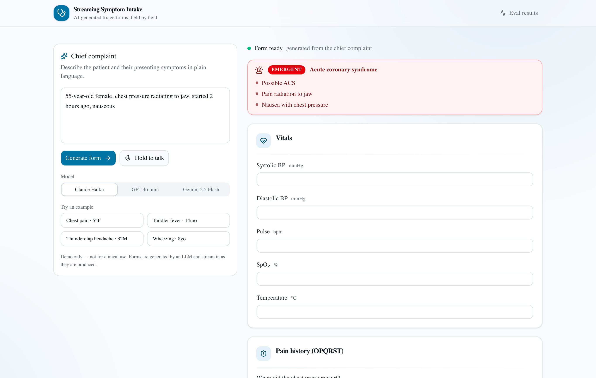

# Streaming Symptom Intake

**[Live demo →](https://streaming-symptom-intake.vercel.app)**



> The user types a complaint as a single line — and a medical intake form streams onto the page field by field: vitals, OPQRST, risk factors, red flags. Each field is a typed React component from a closed registry. The model picks only component IDs and props — no JSX.

---

## What it is and why

Streaming **structured generation** that renders UI on the fly: the server streams typed JSON, the client renders it field by field as it arrives, **preserving user input state across updates**.

Built on `streamText({ output: Output.object({ schema }) })` (server) + `experimental_useObject` (client) — the pair that streams typed JSON while the UI renders it live.

It also demonstrates the **closed component registry pattern**: the model never emits JSX (scary security-wise and impossible to audit) — it only picks a component ID from a pre-registered set and fills in typed props.

## Wow moment

You open the page. You type:

> "55-year-old woman, chest pressure radiating to the jaw, started 2 hours ago while climbing stairs"

A second later sections start landing on the screen **one by one**:

1. First **Vitals capture** (blood pressure, pulse, saturation — required numeric fields)
2. Then the **OPQRST block** for pain (Onset, Provocation, Quality, Radiation, Severity, Time — radio + slider + multiselect)
3. Then **Cardiac risk factors** (history, family history, smoking, statins — multiselect)
4. And on top a **red banner**: "⚠ Suspected ACS — recommend immediate ECG"

Compare it with another input ("3-year-old boy, fever 38.5, second day, rash") — a **different** form arrives: pediatric vitals + rash characterization + immunization status. No OPQRST, no cardiac risk factors.

**The model picks the structure to fit the complaint.** The UI isn't hardcoded — it assembles itself.

## What's wired

- Type-safe streaming pipeline: `streamText({ output: Output.object({ schema }) })` → `experimental_useObject` → guarded renderer. Final value read from `await result.output`; partials iterated via `result.partialOutputStream`.
- 8 field types behind a closed component registry — see `fields/registry.ts`.
- Partial-render safety: `isFieldRenderable` + composite `${id}::${type}` keys + per-field `<FieldErrorBoundary>` + Zod `safeParse` belt-and-suspenders. Tests in `intake/__tests__/`.
- NDJSON observability log (`logs/intake-streams/{sessionId}.ndjson`) with submit / delta / first_field / finish events from both server and client, falling back to stderr on Vercel's read-only FS.
- Voice input via browser `SpeechRecognition` (Chrome / Edge / Safari only — Firefox limited). Hold the mic button to talk.
- 20 hand-curated complaint fixtures + expected shapes in `fixtures/`.
- Offline eval harness in `evals/harness.ts` with field/section Jaccard, critical-field hit, partial-render safety replay, and TTFF p50/p95.
- Eval UI at `/eval` reading `evals/results.json` (server component).

## Data source

No external source needed. This is a fully synthetic project:

- Test set — 20 complaints written by hand (see `fixtures/complaints.json`)
- Optional: example prompts for the model (few-shot) are sketched from publicly available guidelines (American Heart Association OPQRST documentation, AAP pediatric assessment, etc.)

**No real patient data. No PHI. No compliance issues.**

## How to run

```bash
pnpm install

# create .env.local from the example and add your keys
cp .env.local.example .env.local

pnpm dev          # http://localhost:3000
pnpm build        # production build
pnpm test         # vitest — schemas, partial-render guards, scoring
pnpm eval         # offline eval harness (Claude Haiku 4.5)
pnpm eval:gpt-mini
pnpm eval:gemini  # Gemini 2.5 Flash
```

`.env.local` needs `AI_GATEWAY_API_KEY` — all models (Anthropic, OpenAI, and Gemini) route through the Vercel AI Gateway, so the single key covers every provider.

### Voice support

Voice input works in Chrome / Edge / Safari (`webkitSpeechRecognition`). Firefox's implementation is too limited and the button is hidden when the API is absent.

## Documentation files

- **README.md** (this file) — what and why
- [ARCHITECTURE.md](./ARCHITECTURE.md) — stack, registry pattern, FormSpec schema, streaming partial-render strategy
- [DECISIONS.md](./DECISIONS.md) — three architectural forks and why
